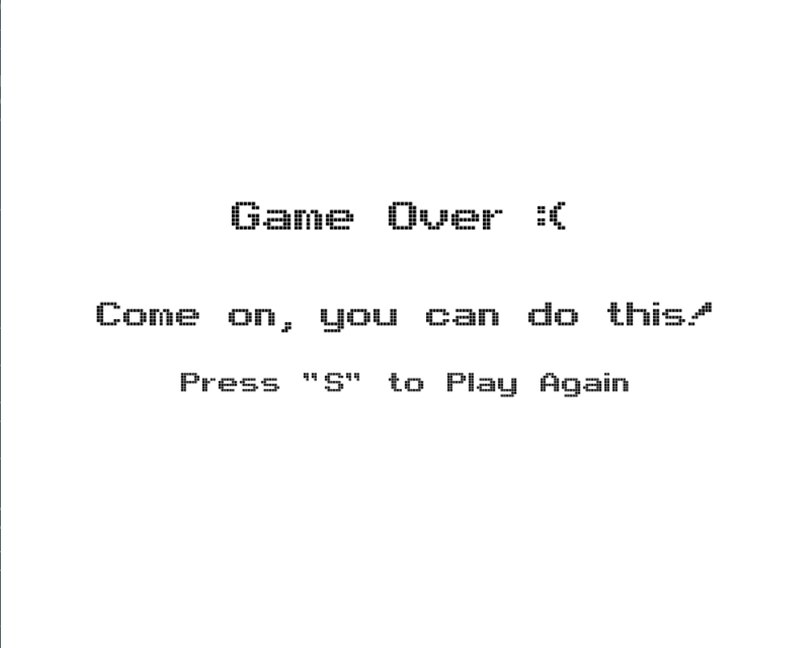
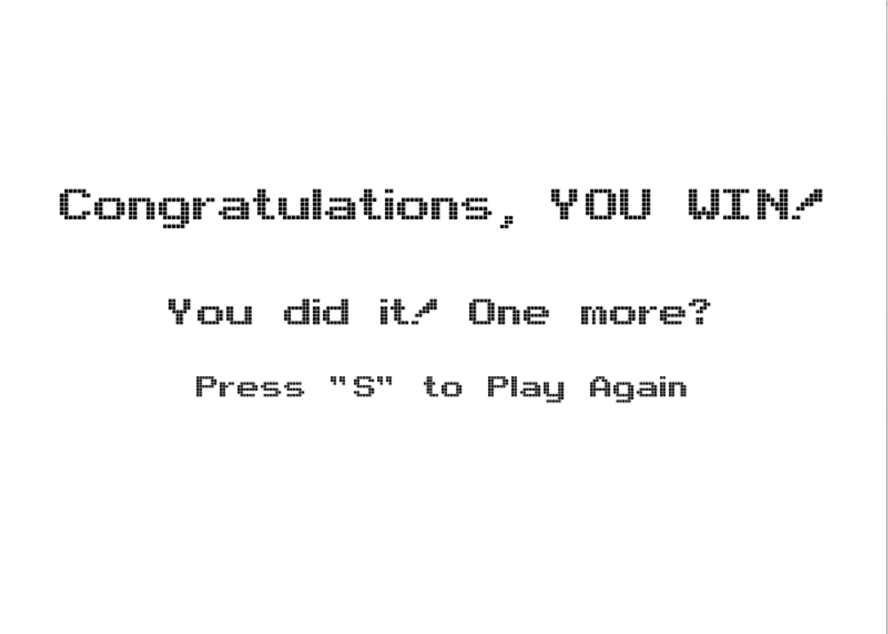

# Space Invaders

My final project for CS 1110: Introduction to Computing using Python is a game based on the retro arcade game Space Invaders.

To run the game, execute the command python space-invaders just outside the space-invaders repository folder or run python __main__.py inside the repository directory (note you will need introcs and kivy modules installed)

# Journey through the game

## Starting the game
When you first run the command to start the game, you will find this screen:

If you press "s", you will find yourself at this screen:

## Goal of the game
You are the ship and the goal of the game is to shoot all of the aliens before they reach the line. You move with the left and right arrow keys and shoot with "space bar". The alien horde is also shooting lasers down at random every second. If a laser hits the ship, you lose a life and you only have 3 lives. See an alien elimination in the image on the left and losing a life on the image to the right:

If you run out of lives or the aliens reach you before shooting all of them, then you see the following screen:

If you manage to destroy all the aliens, then you win and see this screen!

## I hope you enjoy my version of this arcade classic!
